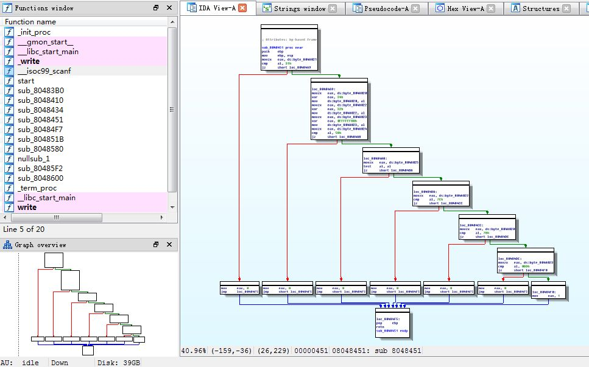

Title: reversing.kr四道Easy题解题攻略
Date: 2014-09-10 23:51:00
Tags: reversing.kr, wargame, hacking, reversing
Slug: reversing-kr-4-easy-challenges
Summary: 本文为逆向工程练习网站reversing.kr中Easy Crack、Easy Keygen、Easy Unpack及Easy ELF的解题攻略。
Summary_en: The write-up for 4 easy challenges in reversing.kr: Easy Crack, Easy Keygen, Easy Unpack and Easy ELF.

# 开篇废话#
Nebula的level11做的有点头大，这时大神Jack又发来了逆向的题目，让我赶紧练练。虽然我负责比赛中逆向类的题目，但逆向题一般都比较难，先放出来的题基本都是其他类别，所以我就彻底成了打（跑）辅（龙）助（套）的角色~~~

这次这套题目来自[reversing.kr](http://reversing.kr/)，棒子的逆向挑战网站。话说棒子的Hacking能力还是挺强的，据说是个什么棒子的优选计划搞出来的成果。

本篇就记录一下4道名称是Easy开头题目，分别是Easy Crack、Easy Keygen、Easy Unpack和Easy ELF。这四题难度非常低，熟练地话掌握好节奏感可以蹭蹭蹭的秒题……

# Easy Crack #
程序启动后输入任意字符会显示一个MessageBox的Incorrect Password。打开OllyDbg，载入程序后查找到目标字符串Incorrect Password，之后转到程序，字符串前后代码如下：

```x86asm
00401080  /$  83EC 64       sub esp,64
00401083  |.  57            push edi
00401084  |.  B9 18000000   mov ecx,18
00401089  |.  33C0          xor eax,eax
0040108B  |.  8D7C24 05     lea edi,dword ptr ss:[esp+5]
0040108F  |.  C64424 04 00  mov byte ptr ss:[esp+4],0
00401094  |.  6A 64         push 64                                  ; /Count = 64 (100.)
00401096  |.  F3:AB         rep stos dword ptr es:[edi]              ; |
00401098  |.  66:AB         stos word ptr es:[edi]                   ; |
0040109A  |.  AA            stos byte ptr es:[edi]                   ; |
0040109B  |.  8B7C24 70     mov edi,dword ptr ss:[esp+70]            ; |
0040109F  |.  8D4424 08     lea eax,dword ptr ss:[esp+8]             ; |
004010A3  |.  50            push eax                                 ; |Buffer
004010A4  |.  68 E8030000   push 3E8                                 ; |ControlID = 3E8 (1000.)
004010A9  |.  57            push edi                                 ; |hWnd
004010AA  |.  FF15 9C504000 call dword ptr ds:[<&USER32.GetDlgItemTe>; \GetDlgItemTextA

...

00401114  |.  6A 40         push 40                                  ; /Style = MB_OK|MB_ICONASTERISK|MB_APPLMODAL
00401116  |.  68 58604000   push Easy_Cra.00406058                   ; |EasyCrackMe
0040111B  |.  68 44604000   push Easy_Cra.00406044                   ; |Congratulation !!
00401120  |.  57            push edi                                 ; |hOwner
00401121  |.  FF15 A0504000 call dword ptr ds:[<&USER32.MessageBoxA>>; \MessageBoxA
00401127  |.  6A 00         push 0                                   ; /Result = 0
00401129  |.  57            push edi                                 ; |hWnd
0040112A  |.  FF15 A4504000 call dword ptr ds:[<&USER32.EndDialog>]  ; \EndDialog
00401130  |.  5F            pop edi
00401131  |.  83C4 64       add esp,64
00401134  |.  C3            retn
00401135  |>  6A 10         push 10                                  ; /Style = MB_OK|MB_ICONHAND|MB_APPLMODAL
00401137  |.  68 58604000   push Easy_Cra.00406058                   ; |EasyCrackMe
0040113C  |.  68 30604000   push Easy_Cra.00406030                   ; |Incorrect Password
00401141  |.  57            push edi                                 ; |hOwner
00401142  |.  FF15 A0504000 call dword ptr ds:[<&USER32.MessageBoxA>>; \MessageBoxA
00401148  |.  5F            pop edi
00401149  |.  83C4 64       add esp,64
0040114C  \.  C3            retn
```

程序通过GetDlgItemTextA获取输入字符串，之后经过一段算法判定对错。下面分析算法：

```x86asm
004010B0  |.  807C24 05 61  cmp byte ptr ss:[esp+5],61
004010B5  |.  75 7E         jnz short Easy_Cra.00401135
```

首先确定esp+5位置字符为0x61，即a。

```x86asm
004010B7  |.  6A 02         push 2
004010B9  |.  8D4C24 0A     lea ecx,dword ptr ss:[esp+A]
004010BD  |.  68 78604000   push Easy_Cra.00406078                   ;  5y
004010C2  |.  51            push ecx
004010C3  |.  E8 88000000   call Easy_Cra.00401150					 ;  strcmp
004010C8  |.  83C4 0C       add esp,0C
004010CB  |.  85C0          test eax,eax
004010CD  |.  75 66         jnz short Easy_Cra.00401135
```

之后判断esp+A处字符串是否为5y。 这里由于`push 2`指令，栈针会上移4byte，因此此时esp=esp-4，所以现在的esp+A相当于上一次的esp-4+A（esp+6），这样就和上一次esp+5成为连续的字符串，也就是3个连续的字符为a5y。

```x86asm
004010CF  |.  53            push ebx
004010D0  |.  56            push esi
004010D1  |.  BE 6C604000   mov esi,Easy_Cra.0040606C                ;  R3versing
004010D6  |.  8D4424 10     lea eax,dword ptr ss:[esp+10]
004010DA  |>  8A10          /mov dl,byte ptr ds:[eax]
004010DC  |.  8A1E          |mov bl,byte ptr ds:[esi]
004010DE  |.  8ACA          |mov cl,dl
004010E0  |.  3AD3          |cmp dl,bl
004010E2  |.  75 1E         |jnz short Easy_Cra.00401102
004010E4  |.  84C9          |test cl,cl
004010E6  |.  74 16         |je short Easy_Cra.004010FE
004010E8  |.  8A50 01       |mov dl,byte ptr ds:[eax+1]
004010EB  |.  8A5E 01       |mov bl,byte ptr ds:[esi+1]
004010EE  |.  8ACA          |mov cl,dl
004010F0  |.  3AD3          |cmp dl,bl
004010F2  |.  75 0E         |jnz short Easy_Cra.00401102
004010F4  |.  83C0 02       |add eax,2
004010F7  |.  83C6 02       |add esi,2
004010FA  |.  84C9          |test cl,cl
004010FC  |.^ 75 DC         \jnz short Easy_Cra.004010DA
004010FE  |>  33C0          xor eax,eax
00401100  |.  EB 05         jmp short Easy_Cra.00401107
00401102  |>  1BC0          sbb eax,eax
00401104  |.  83D8 FF       sbb eax,-1
00401107  |>  5E            pop esi
00401108  |.  5B            pop ebx
00401109  |.  85C0          test eax,eax
0040110B  |.  75 28         jnz short Easy_Cra.00401135
0040110D  |.  807C24 04 45  cmp byte ptr ss:[esp+4],45
00401112  |.  75 21         jnz short Easy_Cra.00401135
```

之后匹配字符串R3versing，并在字符串头部（esp+4处）添加字符为E。因此答案为Ea5yR3versing。

这里算法由于涉及到esp的改变，因此OD跟踪起来比IDA静态分析更加简单。可以直接将程序跑起来，当程序碰到相关判断的地方（一般是cmp）会改变标志位（一般是ZF），只需要改变标志位寄存器的值让它按照你要的逻辑执行下去即可，当然你需要同时记录这些让逻辑保持正确的字符，你可以直接在栈（或数据区）中作出修改。之后当程序跑完之后，你的栈（或数据区）中就是一个正确的值。本程序栈的结构如下：


# Easy Keygen #

注册机题，readme要求Find the Name when the Serial is 5B134977135E7D13。程序跑起来，要求输入名字和序列号，测试了一下Name为abcde和随机的序列号，提示错误：

```dos
C:\Users\GreatYYX>"F:\Crack\reversingkr\Easy_KeygenMe\Easy Keygen.exe"

Input Name: abcde
Input Serial: 12345
Wrong
```

开OD跟着跑一下，下断点在InputName和InputSerial处，可以看到判定对错函数如下：

```x86asm
00401000  /$  81EC 30010000 sub esp,130
00401006  |.  55            push ebp
00401007  |.  56            push esi
00401008  |.  57            push edi
00401009  |.  B9 18000000   mov ecx,18
0040100E  |.  33C0          xor eax,eax
00401010  |.  8D7C24 11     lea edi,dword ptr ss:[esp+11]
00401014  |.  C64424 10 00  mov byte ptr ss:[esp+10],0
00401019  |.  C64424 74 00  mov byte ptr ss:[esp+74],0
0040101E  |.  F3:AB         rep stos dword ptr es:[edi]
00401020  |.  66:AB         stos word ptr es:[edi]
00401022  |.  AA            stos byte ptr es:[edi]
00401023  |.  B9 31000000   mov ecx,31
00401028  |.  33C0          xor eax,eax
0040102A  |.  8D7C24 75     lea edi,dword ptr ss:[esp+75]
0040102E  |.  68 60804000   push Easy_Key.00408060                   ;  Input Name:
00401033  |.  F3:AB         rep stos dword ptr es:[edi]
00401035  |.  66:AB         stos word ptr es:[edi]
00401037  |.  AA            stos byte ptr es:[edi]
00401038  |.  C64424 10 10  mov byte ptr ss:[esp+10],10				 ;  array, 3 bytes
0040103D  |.  C64424 11 20  mov byte ptr ss:[esp+11],20
00401042  |.  C64424 12 30  mov byte ptr ss:[esp+12],30
00401047  |.  E8 6D010000   call Easy_Key.004011B9
0040104C  |.  83C4 04       add esp,4
0040104F  |.  8D4424 10     lea eax,dword ptr ss:[esp+10]
00401053  |.  50            push eax
00401054  |.  68 5C804000   push Easy_Key.0040805C                   ;  %s
00401059  |.  E8 44010000   call Easy_Key.004011A2                   ;  input function
0040105E  |.  8D7C24 18     lea edi,dword ptr ss:[esp+18]
00401062  |.  83C9 FF       or ecx,FFFFFFFF
00401065  |.  33C0          xor eax,eax
00401067  |.  83C4 08       add esp,8
0040106A  |.  33ED          xor ebp,ebp
0040106C  |.  33F6          xor esi,esi
0040106E  |.  F2:AE         repne scas byte ptr es:[edi]
00401070  |.  F7D1          not ecx
00401072  |.  49            dec ecx
00401073  |.  85C9          test ecx,ecx
00401075  |.  7E 3F         jle short Easy_Key.004010B6
00401077  |>  83FE 03       /cmp esi,3
0040107A  |.  7C 02         |jl short Easy_Key.0040107E
0040107C  |.  33F6          |xor esi,esi
0040107E  |>  0FBE4C34 0C   |movsx ecx,byte ptr ss:[esp+esi+C]
00401083  |.  0FBE542C 10   |movsx edx,byte ptr ss:[esp+ebp+10]
00401088  |.  33CA          |xor ecx,edx
0040108A  |.  8D4424 74     |lea eax,dword ptr ss:[esp+74]
0040108E  |.  51            |push ecx
0040108F  |.  50            |push eax
00401090  |.  8D4C24 7C     |lea ecx,dword ptr ss:[esp+7C]
00401094  |.  68 54804000   |push Easy_Key.00408054                  ;  %s%02X
00401099  |.  51            |push ecx
0040109A  |.  E8 B1000000   |call Easy_Key.00401150
0040109F  |.  83C4 10       |add esp,10
004010A2  |.  45            |inc ebp
004010A3  |.  8D7C24 10     |lea edi,dword ptr ss:[esp+10]
004010A7  |.  83C9 FF       |or ecx,FFFFFFFF
004010AA  |.  33C0          |xor eax,eax
004010AC  |.  46            |inc esi
004010AD  |.  F2:AE         |repne scas byte ptr es:[edi]
004010AF  |.  F7D1          |not ecx
004010B1  |.  49            |dec ecx
004010B2  |.  3BE9          |cmp ebp,ecx
004010B4  |.^ 7C C1         \jl short Easy_Key.00401077
004010B6  |>  B9 19000000   mov ecx,19
004010BB  |.  33C0          xor eax,eax
004010BD  |.  8D7C24 10     lea edi,dword ptr ss:[esp+10]
004010C1  |.  68 44804000   push Easy_Key.00408044                   ;  Input Serial:
004010C6  |.  F3:AB         rep stos dword ptr es:[edi]

...

0040111A  |.  68 38804000   push Easy_Key.00408038                   ;  Correct!\n
0040111F  |.  E8 95000000   call Easy_Key.004011B9
00401124  |.  83C4 04       add esp,4
00401127  |.  33C0          xor eax,eax
00401129  |.  81C4 30010000 add esp,130
0040112F  |.  C3            retn
00401130  |>  68 30804000   push Easy_Key.00408030                   ;  Wrong\n
00401135  |.  E8 7F000000   call Easy_Key.004011B9
0040113A  |.  83C4 04       add esp,4
0040113D  |.  33C0          xor eax,eax
0040113F  |.  81C4 30010000 add esp,130
00401145  \.  C3            retn
```

在`00401059`即InputFunction处输入测试用的Name：abcde，并回车。之后程序跑到`004010C1`即InputSerial处，查看栈数据：

```x86asm
0018FDEC   00000005
0018FDF0   0018FF88
0018FDF4   004011B5  Easy_Key.004011B5
0018FDF8   00000004
0018FDFC   0040109F  Easy_Key.0040109F
0018FE00   0018FE84  ASCII "7142537445"
0018FE04   00408054  ASCII "%s%02X"
0018FE08   0018FE84  ASCII "7142537445"
0018FE0C   00000045
0018FE10   00000000
```

可以看到当Name为abcde的时候，栈在InputSerial前有数据`ASCII "7142537445"`出现。通过InputSerial之后程序逻辑可以看出，这段字符串就是根据abcde算出的序列号，并用这个序列号和输入的序列号做对比。因此序列号算法在输入名字后、输入序列号之前(`0040105E`-`004010B4`)。

这段程序还原成C++代码后基本如下：

```cpp
#include <iostream>
#include <string>
using namespace std;

void main(void)
{
	char num[3] = {0x10, 0x20, 0x30};
	char* name = "abcde";
	int len = strlen(name) * 2 + 1;
	char* serial = new char[len];
	memset(serial, 0, len);

	for(int i = 0, j = 0; j < strlen(name); i++, j++)
	{
		if(i >= 3)
			i = 0;
		sprintf(serial, "%s%02x", serial, *(name + j) ^ num[i]);
	}

	cout<<serial<<endl;
}
```

因此可以写出反函数：

```cpp
#include <iostream>
#include <string>
using namespace std;

void main(void)
{
	char num[3] = {0x10, 0x20, 0x30};
	char* serial = "7142537445";
	int len = strlen(serial) / 2 + 1;
	char* name = new char[len];
	memset(name, 0, len);

	for(int i = 0, j = 0; j < strlen(serial); i++, j = j + 2)
	{
		if(i >= 3)
			i = 0;

		char serial_str[3];
		serial_str[0] = *(serial + j);
		serial_str[1] = *(serial + j + 1);
		serial_str[2] = '\0';

		sprintf(name, "%s%c", name, strtol(serial_str, NULL, 16) ^ num[i]);
	}

	cout<<name<<endl;
}
```

把serial用5B134977135E7D13带入跑出来Name为K3yg3nm3。

# Easy Unpack #

readme说需要找OEP，也就是不用脱壳，只需要找入口点。PEiD看一下，壳类型为`ARVID's TDR file [Overlay] *`。才疏学浅，没看到过……不过既然是Easy Unpack，料着也不会难倒哪里去。

打开OD，载入程序，忽略各种错误。程序开始载入kernel32之后用了LoadLibrary、GetModuleHandle和FreeLibrary，典型的包装了IAT的壳。

```x86asm
0040A04B >  68 00A04000     push Easy_Unp.0040A000                   ; ASCII "kernel32.dll"
0040A050    FF15 0DA04000   call dword ptr ds:[<&kernel32.LoadLibrar>; kernel32.LoadLibraryA
0040A056    A3 44A64000     mov dword ptr ds:[40A644],eax
0040A05B    68 18A64000     push Easy_Unp.0040A618                   ; ASCII "GetModuleHandleA"
0040A060    50              push eax
0040A061    FF15 11A04000   call dword ptr ds:[<&kernel32.GetProcAdd>; apphelp.7054FFF6
0040A067    A3 48A64000     mov dword ptr ds:[40A648],eax
0040A06C    68 29A64000     push Easy_Unp.0040A629                   ; ASCII "FreeLibrary"
0040A071    FF35 44A64000   push dword ptr ds:[40A644]
0040A077    FF15 11A04000   call dword ptr ds:[<&kernel32.GetProcAdd>; apphelp.7054FFF6
0040A07D    A3 4CA64000     mov dword ptr ds:[40A64C],eax
```

之后是很长一段外壳操作，直到一个长`jmp`：

```x96asm
0040A082    6A 00           push 0
0040A084    FF15 48A64000   call dword ptr ds:[40A648]
0040A08A    A3 50A64000     mov dword ptr ds:[40A650],eax
0040A08F    B9 00904000     mov ecx,Easy_Unp.00409000
0040A094    BA EE944000     mov edx,Easy_Unp.004094EE
0040A099    3BCA            cmp ecx,edx
0040A09B    74 26           je short Easy_Unp.0040A0C3
0040A09D    8031 10         xor byte ptr ds:[ecx],10
0040A0A0    41              inc ecx
0040A0A1    3BCA            cmp ecx,edx
0040A0A3    74 1E           je short Easy_Unp.0040A0C3

...

0040A1ED    8031 40         xor byte ptr ds:[ecx],40
0040A1F0    41              inc ecx
0040A1F1    3BCA            cmp ecx,edx
0040A1F3    74 06           je short Easy_Unp.0040A1FB
0040A1F5    8031 50         xor byte ptr ds:[ecx],50
0040A1F8    41              inc ecx
0040A1F9  ^ EB D6           jmp short Easy_Unp.0040A1D1
0040A1FB  - E9 506FFFFF     jmp Easy_Unp.00401150
```

程序单步到0040A1FB之后，长跳到00401150，发现二进制数据是55，条件反射`push ebp`，函数入口，于是Ctrl+A强制汇编数据，熟悉的入口结构来了~~

```x86asm
00401150  /.  55            push ebp
00401151  |.  8BEC          mov ebp,esp
00401153  |.  6A FF         push -1
00401155  |.  68 D0504000   push Easy_Unp.004050D0
0040115A  |.  68 1C1E4000   push Easy_Unp.00401E1C                   ;  Entry address; SE 处理程序安装
0040115F  |.  64:A1 0000000>mov eax,dword ptr fs:[0]
00401165  |.  50            push eax
00401166  |.  64:8925 00000>mov dword ptr fs:[0],esp
0040116D  |.  83EC 58       sub esp,58

...

004011BC  |>  8975 FC       mov [local.1],esi
004011BF  |.  E8 E1070000   call Easy_Unp.004019A5
004011C4  |.  FF15 38504000 call dword ptr ds:[405038]               ; [GetCommandLineA

...

004011EE  |.  50            push eax                                 ; /pStartupinfo
004011EF  |.  FF15 34504000 call dword ptr ds:[405034]               ; \GetStartupInfoA
004011F5  |.  E8 1B030000   call Easy_Unp.00401515

...

0040120C  |>  50            push eax
0040120D  |.  FF75 9C       push [local.25]
00401210  |.  56            push esi
00401211  |.  56            push esi                                 ; /pModule
00401212  |.  FF15 30504000 call dword ptr ds:[405030]               ; \GetModuleHandleA

```

因此OEP为00401150。确实非常简单~~

# Easy ELF #
三道Windows之后来了一道Linux，不过无所谓啦。拖到Linux里面，看一下文件类型。

```bash
root@YYX-Kali:~/upload# file Easy_ELF 
Easy_ELF: ELF 32-bit LSB executable, Intel 80386, version 1 (SYSV), dynamically linked (uses shared libs), for GNU/Linux 2.6.15, BuildID[sha1]=0x409edb8e3182380a2f58d49c7323dd895c74e1b7, stripped
```

基本信息就是ELF32位可执行文件，链接动态库，去符号表。

运行一下程序，随便输入一点，提示`Wrong`后直接退出。反复试了一些数字、字母之类的组合，都是一个结果。

打开IDA（Windows下），拖入，开始逆向分析。直接`Shift+F12`打开字符串窗口找到找到`Wrong`，之后利用交叉引用跳回到调用函数，稍微向上翻一点就能看到关键函数了：

```x86asm
.text:080484F7 ; =============== S U B R O U T I N E =======================================
.text:080484F7
.text:080484F7 ; Attributes: bp-based frame
.text:080484F7
.text:080484F7 sub_80484F7     proc near               ; CODE XREF: sub_804851B+34p
.text:080484F7                 push    ebp
.text:080484F8                 mov     ebp, esp
.text:080484FA                 sub     esp, 18h
.text:080484FD                 mov     dword ptr [esp+8], 9 ; n
.text:08048505                 mov     dword ptr [esp+4], offset aCorrect ; "Correct!\n"
.text:0804850D                 mov     dword ptr [esp], 1 ; fd
.text:08048514                 call    _write
.text:08048519                 leave
.text:0804851A                 retn
.text:0804851A sub_80484F7     endp
.text:0804851A
.text:0804851B
.text:0804851B ; =============== S U B R O U T I N E =======================================
.text:0804851B
.text:0804851B ; Attributes: bp-based frame
.text:0804851B
.text:0804851B sub_804851B     proc near               ; DATA XREF: start+17o
.text:0804851B                 push    ebp
.text:0804851C                 mov     ebp, esp
.text:0804851E                 and     esp, 0FFFFFFF0h
.text:08048521                 sub     esp, 10h
.text:08048524                 mov     dword ptr [esp+8], 17h ; n
.text:0804852C                 mov     dword ptr [esp+4], offset aReversing_krEa ; "Reversing.Kr Easy ELF\n\n"
.text:08048534                 mov     dword ptr [esp], 1 ; fd
.text:0804853B                 call    _write
.text:08048540                 call    sub_8048434				; scanf
.text:08048545                 call    sub_8048451				; main algorithm
.text:0804854A                 cmp     eax, 1
.text:0804854D                 jnz     short loc_804855B
.text:0804854F                 call    sub_80484F7				; correct
.text:08048554                 mov     eax, 0
.text:08048559                 jmp     short locret_804857C
.text:0804855B ; ---------------------------------------------------------------------------
.text:0804855B
.text:0804855B loc_804855B:                            ; CODE XREF: sub_804851B+32j
.text:0804855B                 mov     dword ptr [esp+8], 6 ; n
.text:08048563                 mov     dword ptr [esp+4], offset aWrong ; "Wrong\n"
.text:0804856B                 mov     dword ptr [esp], 1 ; fd
.text:08048572                 call    _write
.text:08048577                 mov     eax, 0
.text:0804857C
.text:0804857C locret_804857C:                         ; CODE XREF: sub_804851B+3Ej
.text:0804857C                 leave
.text:0804857D                 retn
.text:0804857D sub_804851B     endp
.text:0804857D
.text:0804857D ; ---------------------------------------------------------------------------
```
sub_804851B函数是提示正确与错误的分支函数，其中四个call，write识别出来了，其他函数跟进去看一下（我已经注释），发现是scanf、主算法函数和返回Correct字符串的函数，其中当主算法函数返回1时判为正确。

然后就重点来看sub_8048451。转到图形视图，一组连续判断，只要逻辑沿着右边下来即可走通（最后eax为1，符合上面的判对条件）。



之后大致扫描了一下程序体，发现反复调用ds段寄存器指向的段内的一些byte，点进去看一下数据区布局（在.bss段，全局变量）。

```x86asm
.bss:0804A020 byte_804A020    db ?                    ; DATA XREF: sub_8048434+Bo
.bss:0804A020                                         ; sub_8048451:loc_8048469r ...
.bss:0804A021 byte_804A021    db ?                    ; DATA XREF: sub_8048451+3r
.bss:0804A022 byte_804A022    db ?                    ; DATA XREF: sub_8048451+27r
.bss:0804A022                                         ; sub_8048451+31w ...
.bss:0804A023 byte_804A023    db ?                    ; DATA XREF: sub_8048451+36r
.bss:0804A023                                         ; sub_8048451+40w ...
.bss:0804A024 byte_804A024    db ?                    ; DATA XREF: sub_8048451+45r
.bss:0804A025 byte_804A025    db ?                    ; DATA XREF: sub_8048451:loc_80484A8r
```

这段都是被引用数据，且是连续的，各1byte，你可以把它们格式化成数组，我比较懒，就不做这步了。基本可以确认数据区为连续的6个byte，即[20][21][22][23][24][25]。

下面进行主算法具体逻辑分析：

```x86asm
.text:08048451 sub_8048451     proc near               ; CODE XREF: sub_804851B+2Ap
.text:08048451                 push    ebp
.text:08048452                 mov     ebp, esp
.text:08048454                 movzx   eax, ds:byte_804A021
.text:0804845B                 cmp     al, 31h
.text:0804845D                 jz      short loc_8048469
.text:0804845F                 mov     eax, 0
.text:08048464                 jmp     loc_80484F5
```

第一段确定[21]等于0x31，就是'1'。

```x86asm
.text:08048469 loc_8048469:                            ; CODE XREF: sub_8048451+Cj
.text:08048469                 movzx   eax, ds:byte_804A020
.text:08048470                 xor     eax, 34h
.text:08048473                 mov     ds:byte_804A020, al
.text:08048478                 movzx   eax, ds:byte_804A022
.text:0804847F                 xor     eax, 32h
.text:08048482                 mov     ds:byte_804A022, al
.text:08048487                 movzx   eax, ds:byte_804A023
.text:0804848E                 xor     eax, 0FFFFFF88h
.text:08048491                 mov     ds:byte_804A023, al
.text:08048496                 movzx   eax, ds:byte_804A024
.text:0804849D                 cmp     al, 58h
.text:0804849F                 jz      short loc_80484A8
.text:080484A1                 mov     eax, 0
.text:080484A6                 jmp     short loc_80484F5
```

第二段做了连续异或，[20] xor 0x34, [22] xor 0x32, [23] xor 0x88, 之后判断[23]是不是为0x58，所以[23]为'X'。

```x86asm
.text:080484A8 loc_80484A8:                            ; CODE XREF: sub_8048451+4Ej
.text:080484A8                 movzx   eax, ds:byte_804A025
.text:080484AF                 test    al, al
.text:080484B1                 jz      short loc_80484BA
.text:080484B3                 mov     eax, 0
.text:080484B8                 jmp     short loc_80484F5
```

第三段要求[25]为0，就是'\0'，字符串结尾。

```x86asm
.text:080484BA
.text:080484BA loc_80484BA:                            ; CODE XREF: sub_8048451+60j
.text:080484BA                 movzx   eax, ds:byte_804A022
.text:080484C1                 cmp     al, 7Ch
.text:080484C3                 jz      short loc_80484CC
.text:080484C5                 mov     eax, 0
.text:080484CA                 jmp     short loc_80484F5
.text:080484CC ; ---------------------------------------------------------------------------
.text:080484CC
.text:080484CC loc_80484CC:                            ; CODE XREF: sub_8048451+72j
.text:080484CC                 movzx   eax, ds:byte_804A020
.text:080484D3                 cmp     al, 78h
.text:080484D5                 jz      short loc_80484DE
.text:080484D7                 mov     eax, 0
.text:080484DC                 jmp     short loc_80484F5
.text:080484DE ; ---------------------------------------------------------------------------
.text:080484DE
.text:080484DE loc_80484DE:                            ; CODE XREF: sub_8048451+84j
.text:080484DE                 movzx   eax, ds:byte_804A023
.text:080484E5                 cmp     al, 0DDh
.text:080484E7                 jz      short loc_80484F0
.text:080484E9                 mov     eax, 0
.text:080484EE                 jmp     short loc_80484F5
```

之后连续三段对刚才异或后的数字进行操作。异或的反函数还是异或，所以直接异或就能得到结果。这里用python计算一下：

```python
>>> chr(0x32 ^ 0x7c)
'N'
>>> chr(0x34 ^ 0x78)
'L'
>>> chr(0x88 ^ 0xdd)
'U'`
```

所以[20]=L，[22]=N，[23]=U。

最后eax置1并返回。这样可以得到答案为`L1NUX`。